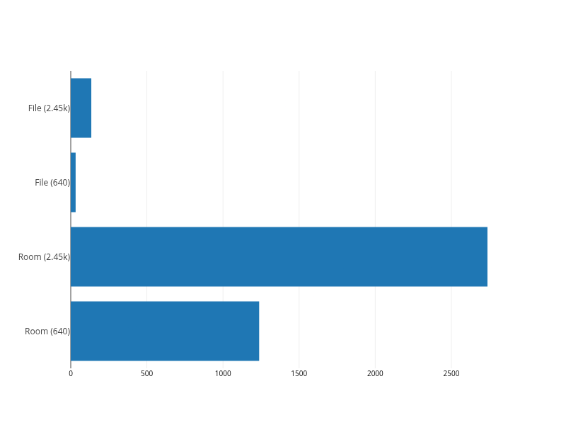

# **SmartScanSdk**

## Table of Contents

- [Overview](#overview)
- [Key Structure](#key-structure)
- [Installation](#installation)
  - [1. Install Core Module](#1-install-core-module)
  - [2. Install Extensions Module (Optional)](#2-install-extensions-module-optional)
- [Benchmark Summary](#benchmark-summary)
  - [The Room Approach](#the-room-approach)
  - [The File Approach](#the-file-approach)
- [Design Choices](#design-choices)
  - [Core and Extensions](#core-and-extensions)
  - [Constraints](#constraints)
  - [Batch Processing](#batch-processing)
  - [Model](#model)
    - [Model Loaders](#model-loaders)
  - [Embeddings](#embeddings)
- [Gradle / Kotlin Setup Notes](#gradle--kotlin-setup-notes)

<a name="overview"></a>

## **Overview**

SmartScanSdk is a modular Android SDK that powers the **SmartScan app**. It provides tools for:

* **Image & video processing**
* **On-device ML inference**
* **Semantic media indexing and search**

The SDK is **highly extensible**, allowing developers to plug in new ML models or features without bloating the core runtime.

---

## **Key Structure**

```
SmartScanSdk/
 ├─ core/                                   # Minimal, essential functionality
 │   ├─ build.gradle                        # Core module Gradle, Maven publishing enabled
 │   ├─ ml/                                 # On-device ML infra + models
 │   │   ├─ embeddings/                     # Interfaces + generic embedding handling
 │   │   │   ├─ clip/                       # CLIP-specific preprocessing + inference
 │   │   │   │   ├─ ByteEncoder.kt
 │   │   │   │   ├─ ClipImageEmbedder.kt
 │   │   │   │   ├─ ClipTextEmbedder.kt
 │   │   │   │   ├─ Constants.kt
 │   │   │   │   ├─ PreProcess.kt
 │   │   │   │   └─ Tokenizer.kt
 │   │   │   ├─ EmbeddingTypes.kt
 │   │   │   ├─ EmbeddingUtils.kt
 │   │   │   └─ FewShotClassifier.kt
 │   │   └─ models/
 │   │       ├─ BaseModel.kt
 │   │       ├─ Loaders.kt
 │   │       └─ OnnxModel.kt
 │   │
 │   ├─ processors/                         # Batch processing and pipelines
 │   │   ├─ BatchProcessor.kt
 │   │   └─ ProcessorTypes.kt
 │   │
 │   └─ utils/                              # General-purpose helpers
 │       ├─ ImageUtils.kt                  
 │       ├─ MemoryUtils.kt
 │       └─ VideoUtils.kt                  
 │
 ├─ extensions/                             # Optional, pluggable features
 │   ├─ build.gradle                        # Extensions module Gradle, depends on core
 │   ├─ embeddings/                         # File-based or custom embedding stores
 │   │   ├─ FileEmbeddingRetriever.kt
 │   │   └─ FileEmbeddingStore.kt
 │   │
 │   ├─ indexers/                           # Media indexing helpers
 │   │   ├─ ImageIndexer.kt
 │   │   └─ VideoIndexer.kt
 │   │
 │   └─ organisers/                         # Higher-level orchestration
 │       └─ Organiser.kt
 │
 ├─ build.gradle                            # Root build config (publishing, plugins, etc.)
 └─ settings.gradle                         # Declares `core` and `extensions` modules

```

**Notes:**

* Both `core` and `extensions` are standalone Gradle modules — they can be installed separately depending on your needs.
* Both modules are setup for **Maven publishing** via `maven-publish`.

---

## **Installation**

### **1. Install Core Module**

Add the dependency in your app module:

```gradle
implementation("com.github.dev-diaries41:core:1.0.0")
```

### **2. Install Extensions Module (Optional)**

Add the dependency in your app module:

```gradle
implementation("com.github.dev-diaries41:extensions:1.0.0")
```

> `extensions` depends on `core` transitively, so adding `extensions` alone is sufficient if you need both.

---

## Benchmark Summary

### Real-Life Test Results````
| Number of Embeddings | Room Load Time | File Load Time |
|---------------------|----------------|----------------|
| 640                 | 1,237.5 ms    | 32 ms          |
| 2,450               | 2,737.2 ms    | 135 ms         |

**Observations:**
- Room loads are much slower due to SQLite row-by-row deserialization and LiveData overhead.
- File-based loading with memory-mapped binary file is significantly faster, even for small datasets.

---

### Instrumented Test Benchmarks

| Number of Embeddings | Room Load Time | File Load Time |
|---------------------|----------------|----------------|
| 2,500               | 2,539 ms       | 20 ms          |
| 10,000              | 7,014 ms       | 49 ms          |
| 20,000              | 21,729 ms      | 75 ms          |
| 30,000              | 48,547 ms      | 112 ms         |
| 40,000              | 83,496 ms      | 82 ms          |

**Observations:**
- Room scales roughly linearly with dataset size.
- File-based approach maintains extremely fast load times, even for tens of thousands of embeddings.
- The performance gap between Room and File approaches grows with dataset size.




## **Design Choices**

### Core and Extensions

* **core** → minimal runtime: shared interfaces, embedding + model execution, efficient batch/concurrent processing, and only the abstractions required for extension.
* **extensions** → concrete implementations: indexers, retrievers, organisers, embedding stores, and other optional ML or app-level features built on top of core.

### Constraints

* For offline on-device vector search on Android, the full index needs to be loaded in-memory due to lack of native VectorDB support for android. (could maybe make a custom VectorDB?)
* Some users of the SmartScan app have 40K+ images so fast processing and loading of index is essential for good UX of search functionality.
* A healthy balance between speed and memory/cpu usage is required to satisfy good UX and manage variable constrained CPU and Memory resources due to:
  - Androids range of devices, where low end devices can have as little as 1GB Memory and mid end devices about 4-8 GB.
  - Available memory is also constrained because of contention with other apps in use on the user device.
  - Faster speed by means of concurrency, leads to More CPU Usage, which can cause device heating and faster battery drain

For all the above reasons its important concurrency is handled dynamically and efficiently, hence the use of `BatchProcessor` shown below

```kotlin
// For BatchProcessor’s use case—long-running, batched,  asynchronous processing—the Application context should be used.
abstract class BatchProcessor<TInput, TOutput>(
  private val application: Application,
  protected val listener: IProcessorListener<TInput, TOutput>? = null,
  private val options: ProcessOptions = ProcessOptions(),
) {
  companion object {
    const val TAG = "BatchProcessor"
  }

  open suspend fun run(items: List<TInput>): Metrics = withContext(Dispatchers.IO) {
    val processedCount = AtomicInteger(0)
    val startTime = System.currentTimeMillis()

    try {
      if (items.isEmpty()) {
        Log.w(TAG, "No items to process.")
        return@withContext Metrics.Success()
      }

      val memoryUtils = MemoryUtils(application, options.memory)

      listener?.onActive(application)

      for (batch in items.chunked(options.batchSize)) {
        val currentConcurrency = memoryUtils.calculateConcurrencyLevel()
        val semaphore = Semaphore(currentConcurrency)

        val deferredResults = batch.map { item ->
          async {
            semaphore.withPermit {
              try {
                val output = onProcess(application, item)
                val current = processedCount.incrementAndGet()
                val progress = current.toFloat() / items.size
                listener?.onProgress(application, progress)
                output
              } catch (e: Exception) {
                listener?.onError(application, e, item)
                null
              }
            }
          }
        }

        val outputBatch = deferredResults.mapNotNull { it.await() }
        onBatchComplete(application, outputBatch)
      }

      val endTime = System.currentTimeMillis()
      val metrics = Metrics.Success(processedCount.get(), timeElapsed = endTime - startTime)

      listener?.onComplete(application, metrics)
      metrics
    }
    catch (e: CancellationException) {
      throw e
    }
    catch (e: Exception) {
      val metrics = Metrics.Failure(
        processedBeforeFailure = processedCount.get(),
        timeElapsed = System.currentTimeMillis() - startTime,
        error = e
      )
      listener?.onFail(application, metrics)
      metrics
    }
  }

  // Subclasses must implement this
  protected abstract suspend fun onProcess(context: Context, item: TInput): TOutput

  // Forces all SDK users to consciously handle batch events rather than optionally relying on listeners.
  // This can prevent subtle bugs where batch-level behavior is forgotten.
  // Subclasses can optionally delegate to listener (client app) by simply calling listener.onBatchComplete in implementation
  protected abstract suspend fun onBatchComplete(context: Context, batch: List<TOutput>)

}

```

### Model
The architecture separates **model loading** from **inference execution**, enabling type-safe, backend-specific models while keeping the SDK core agnostic. This modular approach allows adding new loaders or backends independently, simplifying testing and portability. Overall, it ensures a clean, extensible design suitable for multi-platform support.

```kotlin
abstract class BaseModel<InputTensor> : AutoCloseable {
    protected abstract val loader: IModelLoader<*> // hidden implementation detail

    abstract suspend fun loadModel()
    abstract fun isLoaded(): Boolean // optional, may be removed
    abstract fun run(inputs: Map<String, InputTensor>): Map<String, Any>
}


```
#### Model Loaders
* `FilePath` - Allows loading model from a local file path, enabling the use of downloadable models
**Important Note: The SmartScan app already uses `Resource` based loading**

```kotlin
// Loaders.kt

interface IModelLoader<T> {
    suspend fun load(): T
}

sealed interface ModelSource
data class FilePath(val path: String) : ModelSource
data class ResourceId(@RawRes val resId: Int) : ModelSource


class FileOnnxLoader(private val path: String) : IModelLoader<ByteArray> {
    override suspend fun load(): ByteArray = File(path).readBytes()
}

class ResourceOnnxLoader(private val resources: Resources, @RawRes private val resId: Int) : IModelLoader<ByteArray> {
    override suspend fun load(): ByteArray = resources.openRawResource(resId).readBytes()
}
```

### Embeddings 

`Embedding` represents a raw vector for a single media item, with `id` corresponding to its `MediaStoreId`. `PrototypeEmbedding` represents an aggregated class-level vector used for few-shot classification, with `id` corresponding to a class identifier. Keeping them separate preserves **semantic clarity** and ensures API consumers can distinguish between per-item embeddings and classification prototypes.
---

## **Gradle / Kotlin Setup Notes**

* Both modules target **Java 17** and Kotlin JVM 17.
* Lint target SDK = 34, compile SDK = 36, min SDK = 30.
* `core` exposes essential Android KTX libraries (`androidx.core:core-ktx`) and ONNX runtime.
* `extensions` pulls in `core` transitively, so consumers only need to include `extensions` if using optional features.
* Maven artifact details:

    * `groupId`: `com.github.dev-diaries41`
    * `artifactId`: module name (`core` / `extensions`)
    * `version`: configurable via `publishVersion` or defaults to `1.0.0`

---