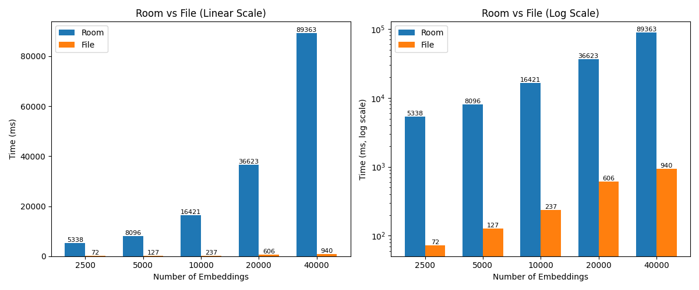

# **SmartScanSdk**

## **Overview**

SmartScanSdk is a modular Android SDK that powers the **SmartScan app**. It provides tools for:

* **Image & video processing**
* **On-device ML inference**
* **Semantic media indexing and search**

The SDK is **highly extensible**, allowing developers to plug in new ML models or features without bloating the core runtime.

---

## **Key Structure**

```
SmartScanSdk/
 ├─ core/                                   # Minimal, essential functionality
 │   ├─ build.gradle                         # Core module Gradle, Maven publishing enabled
 │   ├─ ml/                                 # On-device ML infra + models
 │   │   ├─ embeddings/                     # Interfaces + generic embedding handling
 │   │   │   ├─ clip/                       # CLIP-specific preprocessing + inference
 │   │   │   │   ├─ ByteEncoder.kt
 │   │   │   │   ├─ ClipEmbedder.kt
 │   │   │   │   ├─ Constants.kt
 │   │   │   │   ├─ PreProcess.kt
 │   │   │   │   └─ Tokenizer.kt
 │   │   │   ├─ EmbeddingTypes.kt
 │   │   │   ├─ EmbeddingUtils.kt
 │   │   │   └─ FewShotClassifier.kt
 │   │   └─ models/
 │   │       ├─ ModelTypes.kt
 │   │       └─ OnnxModel.kt
 │   │
 │   ├─ processors/                         # Batch processing and pipelines
 │   │   ├─ BatchProcessor.kt
 │   │   ├─ ProcessorTypes.kt
 │   │   └─ StateFlowBatchProcessor.kt
 │   │
 │   └─ utils/                              # General-purpose helpers
 │       ├─ FileUtils.kt
 │       ├─ ImageUtils.kt                   # bitmap/frame preprocessing, scaling, caching
 │       ├─ MemoryUtils.kt
 │       └─ VideoUtils.kt (future)          # frame extraction, video sampling
 │
 ├─ extensions/                             # Optional, pluggable features
 │   ├─ build.gradle                         # Extensions module Gradle, depends on core
 │   ├─ embeddings/                         # File-based or custom embedding stores
 │   │   └─ FileEmbeddingStore.kt
 │   └─ indexers/                           # Media indexing helpers
 │       ├─ ImageIndexer.kt
 │       └─ VideoIndexer.kt
 │
 └─ settings.gradle / root build.gradle     # Project-level config, Maven publishing setup
```

**Notes:**

* Both `core` and `extensions` are standalone Gradle modules — they can be installed separately depending on your needs.
* `core` = lean runtime → preprocessing, model execution, embeddings.
* `extensions` = innovation layer → embedding stores, indexing, optional ML models.
* Both modules are setup for **Maven publishing** via `maven-publish`.

---

## **Installation**

### **1. Install Core Module**

Add the dependency in your app module:

```gradle
implementation("com.github.dev-diaries41:core:1.0.0")
```

### **2. Install Extensions Module (Optional)**

Add the dependency in your app module:

```gradle
implementation("com.github.dev-diaries41:extensions:1.0.0")
```

> `extensions` depends on `core` transitively, so adding `extensions` alone is sufficient if you need both.

---

## Benchmark Summary
### **The Room Approach**

The schema for the Room version was `id (long), date (long), embedding (float array)`. In the SearchViewModel the index was loaded as LiveData. Benchmarks for loading:

* 640 entries: 1237.5ms
* 2.45k entries: 2737.2ms

---

### **The File Approach**

The file approach saves the index as a binary file, then loads it with a memory-mapped file. This allows for much faster reads. Benchmarks for the same datasets:

* 640 entries: 32ms
* 2.45k entries: 135ms

That’s roughly 40× faster at 640 entries and 20× faster at 2.45k. More importantly, the time scales linearly with the number of entries. At 50k entries the load time should still be only 2–3 seconds, which is the same time Room takes just to load 2.45k.




## **Design Choices**

### Design Constraints
* For offline on-device vector search, the full index needs to be loaded in-memory due to lack of native vectordb for android.
* Some users have 40K+ images so fast processing and loading is essential for good UX
* A healthy balance between speed and memory/cpu usage is required to satisfy good UX and manage constrained CPU and Memory resources

## Key Aspects
* **core**: Minimal essential functionality, primarily focused on fundamental ML logic, Interfaces and efficient pipelines processing.
* **extensions** = Innovation layer, primarily focused on implementation heavy logic e.g  file-based embedding stores, OCR, multimodal models, indexing, new retrieval methods.
* **ml** = the heart — all model-related logic goes here, grouped by task (e.g.,`embeddings`, `models`).
* **Efficient on-device processing:** The `BatchProcessor` and `IProcessor` design provides a consistent, structured way to handle CPU- and memory-intensive tasks concurrently. This is especially important for edge devices running ML workloads. Users can implement `IProcessor` instances to represent such intensive tasks, while `BatchProcessor` manages batching, concurrency, memory usage, and progress reporting in a safe and efficient manner.
* Focus on **running efficiently on-device** (mobile CPUs, GPUs, NNAPI).


---

## **Gradle / Kotlin Setup Notes**

* Both modules target **Java 17** and Kotlin JVM 17.
* Lint target SDK = 34, compile SDK = 36, min SDK = 30.
* `core` exposes essential Android KTX libraries (`androidx.core:core-ktx`) and ONNX runtime.
* `extensions` pulls in `core` transitively, so consumers only need to include `extensions` if using optional features.
* Maven artifact details:

    * `groupId`: `com.github.dev-diaries41`
    * `artifactId`: module name (`core` / `extensions`)
    * `version`: configurable via `publishVersion` or defaults to `1.0.0`

---